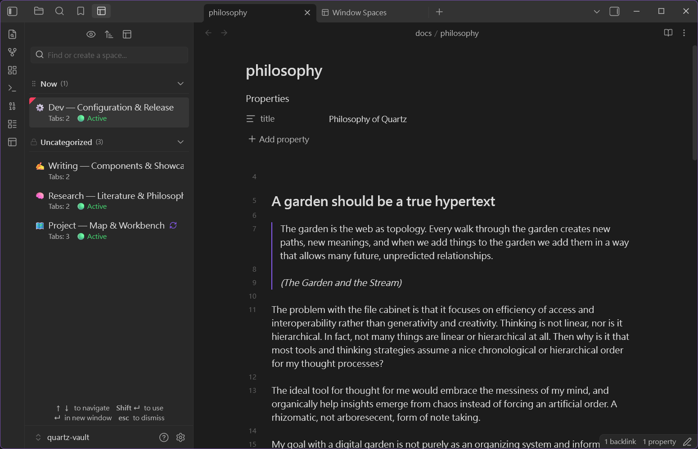

# Window Spaces - Obsidian Plugin

Save and restore window layouts for Obsidian popout windows. Seamlessly manage multi-window workspaces with high performance and zero DOM jitter.

---

## 🌐 Language / 語言

[ English ](README.md) | [ 繁體中文 ](README.zh-TW.md) | [ 简体中文 ](README.zh-CN.md)

---

### 💡 Why Window Spaces? (vs. Native Workspaces)

Obsidian's built-in **Workspaces** plugin is designed for **global application state**—restoring a workspace overwrites your entire Obsidian setup (closing all open windows and replacing your main layout).

**Window Spaces** is purpose-built for **individual popout windows**:
- 🎯 **Zero Main Window Interference**: Captures and restores layouts *only* within a target popout window without touching your main workspace or sidebars.
- 🖥️ **Multi-Monitor Friendly**: Keep separate reference windows, Kanban boards, or research notes on secondary displays and swap their layouts independently.
- 🚀 **Spawn New Windows on Demand**: Click normally (or press `Enter`) to restore any saved layout into a brand-new popout window instantly.
- 🔄 **Per-Layout Auto-Save**: Enable auto-save individually on specific layouts with 5s debounce protection and window-close instant snapshot.

| Feature | 🏛️ Native Workspaces | 🪟 Window Spaces |
| :--- | :--- | :--- |
| **Scope** | **Global**: Overwrites main window & all sidebars | **Window-Scoped**: Affects only the target popout window |
| **Multi-Monitor** | ❌ Destroys setups across all screens | ✅ Manages individual screens independently |
| **Spawn New Window** | ❌ Always overwrites current layout | ✅ Click normally or press `Enter` to open in a new window |
| **Auto-Save** | ❌ Global manual save / hard overwrite | ✅ **Per-layout 🔄 auto-save** with 5s debounce |
| **Smart Naming** | ❌ Manual typing only | ✅ **Pinned-first smart name** (`Pinned Note & Active Note`) |
| **Hover Preview** | ❌ No content preview | ✅ **File list tooltips** on hover before restoring |
| **Layout Integrity** | ❌ Missing files cause tab collapses | ✅ **Native empty tabs** preserve pane shapes |

### ✨ Key Features
- **Popout Window Preservation**: Captures splits, tabs, active file, view modes, and exact window dimensions/position.
- **Smart Layout Naming**: Automatically generates intuitive names based on pinned files and active notes (`Pinned Note & Active Note`).
- **Context-Aware Restoration**: Click normally (or press `Enter`) to spawn a new popout window; hold `Shift` (or press `Shift + Enter`) to restore directly into the current popout window.
- **Per-Layout Auto-Save**: Toggle 🔄 auto-save on specific layouts with a 5-second debounced background update and immediate save on window close.
- **Unified Quick-Switch & Management Modal**: Search layouts in real-time, view hover file tooltips, sort by 6 dimensions (gear menu ⚙️), rename, edit, auto-save, or delete.
- **Safe Placement & Guardrails**: Prevents off-screen windows on monitor changes and guards against accidental 0-file layout overwrites.

### 🖼️ Screenshots

| Multi-workspace popouts | Popout window | Sidebar panel |
| :---: | :---: | :---: |
|  |  |  |

### 📥 Installation

#### From Community Plugins (Recommended — Application Pending)
1. Open Obsidian **Settings** > **Community plugins**.
2. Search for **Window Spaces**.
3. Click **Install** and then **Enable**.

#### Manual Installation
1. Download `main.js`, `styles.css`, and `manifest.json` from the latest GitHub Release.
2. Copy them to `<your-vault>/.obsidian/plugins/window-spaces/`.
3. Reload Obsidian and enable **Window Spaces** in settings.

### 🚀 Usage

#### 1. Save Window Layout
- Open the command palette (`Ctrl/Cmd + P`) in any popout window.
- Run `Window Spaces: Save current window layout`.
- Enter a name or use the auto-generated smart name, then press `Enter`.

#### 2. Open Window Layouts
- Run `Window Spaces: Open window layouts`.
- Select a layout from the unified restore and management dialog.
- Click a layout normally, or press `Enter`, to restore it in a new popout window.
- Hold `Shift` while clicking a layout, or press `Shift + Enter`, to restore it in the current active popout window.
- Access dropdown options (∨) to toggle auto-save, rename, edit, or delete saved layouts.
- See the [Use Cases & Workflows](#use-cases--workflows) section below for project, research, Canvas, Tasks, writing, meeting, and development workspace examples.

### 🚀 Use Cases & Workflows

Think of each saved Space as a reusable **work cabin** for a project, research topic, work session, or recurring process:

- **Basic pattern**: Pin a navigation view (Base, Canvas, or Tasks) on the left, keep the file you are working on to the right, and pin the nav view so clicking files never replaces it. Save the arrangement under a project or workflow name.
- **Project control center** (`Project — Map & Workbench`): Pinned Base map on the left, project home, specs and meeting notes to the right.
- **Research literature** (`Research — Literature Review`): Literature Base on the left, reading notes and open research questions to the right.
- **Canvas visual planning** (`Planning — Canvas & Notes`): Canvas holds the big picture on the left while specs and decision notes are edited on the right.
- **Tasks cycle management** (`Weekly Review — Tasks & Notes`, `Daily Focus`): Tasks query on the left, daily note and source documents to the right.
- **Writing & content** (`Writing — Draft & References`): Content Base on the left, draft in the center, references and checklists to the right.
- **Meetings & decisions** (`Meeting — Agenda & Actions`): Meeting Base and agenda on the left, running notes and follow-up Tasks to the right.
- **Software development** (`Dev — Issue Triage`, `Dev — Implementation`, `Dev — Code Review`, `Dev — Release`): Issue Base on the left, specs and implementation notes to the right.

Once saved, a single click (or `Enter`) restores the whole cabin into a fresh popout window, or `Shift + click` (`Shift + Enter`) applies it to the current popout.

### ⌨️ Keyboard Shortcuts
- No default command shortcuts are assigned. You can assign an optional shortcut to `Window Spaces: Open window layouts` in Obsidian's Hotkeys settings.
- Within the layout list, `Enter` restores in a new popout and `Shift + Enter` restores in the current active popout.

### 💻 Compatibility
- **Obsidian Version**: `v0.15.0+`
- **Platform**: Desktop only (Windows, macOS, Linux)
