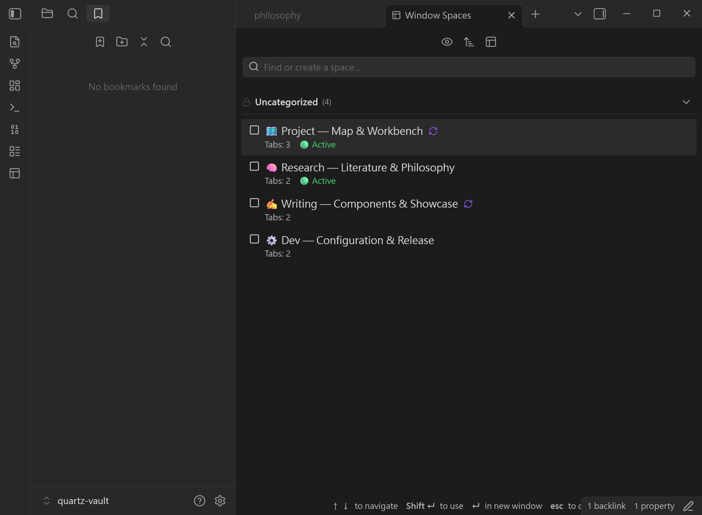

# Window Spaces - Obsidian 窗口工作区管理插件

> **告别拥挤的主窗口。将重量级插件与多元工作流，无痛迁移至独立、专注的 Popout 弹出窗口工作舱。**

---

## 🌐 Language / 语言

[ English ](README.md) | [ 繁體中文 ](README.zh-TW.md) | [ 简体中文 ](README.zh-CN.md)

---

## 💡 设计哲学：为你的“万物笔记库”打造无干扰的专注工作舱

Obsidian 灵活的布局与强大的插件生态，让许多人将其视为终极的**“Everything Notebook（万物笔记库）”**。然而，随着笔记库日益庞大与各类实用插件的加入，主窗口往往变得无比拥挤：

- 🗂️ **拥挤不堪的主窗口**：Canvas 白板、Excalidraw 绘图、Dataview 查询仪表板、关系图谱与多栏分屏笔记，都在争夺同一个主窗口的有限空间。
- ⚡ **繁重的语境切换成本**：在项目规划、深度文献研究、日常任务审查之间切换时，必须频繁打乱原有标签页与侧边栏排版。
- 🖥️ **未被充分发挥的多显示器优势**：在多屏或大屏环境下，缺乏一套能将不同窗口的独立布局各自持久保存与快速切换的机制。

**Window Spaces** 作为 Obsidian 的自然、无缝扩展而生。它不是要取代现有布局，而是通过**焦点拦截技术**与 **Per-Window 独立窗口布局生命周期管控**，让各类重量级插件与复合笔记分屏，无痛迁移至独立的 **Popout 窗口工作舱（Spaces）**。

主窗口保持简洁干净，不同任务在各自的独立窗口中自由协作、互不干扰。

---

## 🖼️ 界面预览

| 🗺️ 独立 Popout 窗口工作舱 | 🗂️ 侧边栏原生管理面板 | 📑 编辑区标签页管理模式 |
| :---: | :---: | :---: |
|  |  |  |
| *Canvas 视觉白板 + Markdown 双栏分屏与状态栏识别* | *整合式 Spaces 选择器、启用状态提示与快速搜索* | *在主编辑区标签页中进行完整工作区管理与检视* |

---

## ✨ 核心特色

### 🪟 独立窗口工作舱（Per-Window Layouts）
- **真正的窗口隔离**：完整保存并恢复弹出窗口（Popout Window）的分屏结构、打开文件、固定状态、视图模式与屏幕坐标，完全不改动主窗口与侧边栏。
- **智能窗口聚焦**：当尝试恢复一个已经打开在弹出窗口的 Space 时，自动平滑聚焦该窗口，避免打开重复窗口。
- **空白标签页结构保护**：即便特定文件暂时丢失或重命名，仍会保留原有的分栏结构，确保版面不崩溃。

### 🔄 独立空间自动保存（Per-Space Auto-Save）
- **无感自动同步**：可为特定 Space 开启 `🔄 自动保存` 功能。工作过程中的分栏调整与打开标签页，会在后台以 5 秒防抖自动更新，并在关闭窗口时立即快照存档。

### ⚡ 焦点拦截与全键盘极速操作
- **键盘优先体验**：支持 `↑` / `↓` 上下浏览、`Enter` 立即于新弹出窗口打开、`Shift + Enter` 应用至当前窗口、`Esc` 关闭。
- **安全焦点拦截**：仅在面板本身获得焦点时接管方向键与快捷操作，绝不干扰笔记正文编辑、搜索输入框或第三方弹出窗口。

### 🎨 三合一原生界面与视觉自定义
- **多元管理入口**：可自由将管理面板停靠在**左侧边栏**、**右侧边栏**、**编辑区标签页（Tab）**，或通过 **Ribbon 图标与快捷键** 呼出快速弹出窗口。
- **视觉自定义识别**：支持自定义 Emoji 图标、颜色徽章、标签分类与 6 种维度排序。
- **悬停内容预览**：鼠标悬停在 Space 上时，实时显示该空间包含的文件列表、活动标签页与固定结构。

### 🔒 隐私与安全机制
- **100% 本地运行**：所有布局与设置均保存在本地 Vault，无任何远程通信。
- **屏幕溢出防护**：拔除外接显示器时自动校正窗口生成坐标，避免弹出窗口出现在屏幕可视范围外。
- **JSON 批量导入/导出**：轻松备份配置或在多台设备间同步工作空间模板。

---

## 🚀 典型工作空间场景（Space Workflows）

每个 Space 就像是一个专属的**作业舱**，针对特定情境量身订做：

| 工作空间场景 | 布局配置范例 | 适用情境 |
| :--- | :--- | :--- |
| 🗺️ **Project Map & Workbench** | 左侧固定 Canvas 白板 / 概览 + 右侧项目规格笔记 | 架构设计、里程碑规划、交付项目实时跟踪 |
| 🧠 **Deep Research & Literature** | 左侧文献阅读 / PDF + 右侧大纲与双链卡片笔记 | 沉浸式学术研读、概念串联与知识萃取 |
| ✍️ **Focus Writing & Showcase** | 纯净 Markdown 编辑区 + 实时样式预览 | 长篇创作、技术专栏写作、发布前校对排版 |
| ⚙️ **Dev & System Maintenance** | Dataview 查询表格 + 系统设置模板与清单 | 笔记库定期维护、发布检查清单、任务分流 |

---

## 📥 安装方式

### 从 Obsidian 社区插件市场安装（推荐）
1. 打开 Obsidian **设置** > **社区插件**。
2. 关闭“安全模式”，点击“浏览”。
3. 搜索 **Window Spaces**。
4. 点击“安装”，随后点击“启用”。

### 手动安装
1. 前往 [GitHub Releases](https://github.com/edwardsayer/obsidian-window-spaces/releases) 下载最新版的 `main.js`、`manifest.json` 与 `styles.css`。
2. 在您的 Vault 中创建目录：`<vault>/.obsidian/plugins/window-spaces/`。
3. 将下载的 3 个文件放入该目录中。
4. 重新加载 Obsidian 并在“社区插件”中启用 **Window Spaces**。

---

## 🛠️ 快速上手

### 1. 创建并保存你的第一个 Space
1. 创建一个新弹出窗口（按 `Ctrl/Cmd + Shift + N` 或将任何标签页拖拽出来）。
2. 排版好你所需的分屏视图（例如：左侧 Canvas、右侧 Markdown 笔记）。
3. 按 `Ctrl/Cmd + P` 打开命令面板，执行 **`Window Spaces: Save current Space`**。
4. 输入名称（或使用自动生成的智能命名），并可设置 Emoji 图标与颜色标签。

### 2. 恢复与管理 Space
- 通过左侧 **Ribbon 图标**、侧边栏或执行 **`Window Spaces: Open as popup window`** 打开面板。
- **`点击` 或 `Enter`**：立即在新弹出窗口中打开该 Space。
- **`Shift + 点击` 或 `Shift + Enter`**：将该 Space 应用覆盖至当前的弹出窗口。
- 点击右侧菜单（`...` 或右键）可随时开启 **自动保存 🔄**、重命名、编辑或删除。

---

## ⌨️ 快捷键一览

| 操作动作 | 快捷键 / 触发方式 | 说明 |
| :--- | :--- | :--- |
| **打开 Spaces 弹出窗口** | 可于 Obsidian 快捷键设置 | 快速呼出浮动切换与管理对话框 |
| **于新弹出窗口打开** | `Enter` / 单击鼠标左键 | 于独立新窗口中还原选取的 Space |
| **应用至当前窗口** | `Shift + Enter` / `Shift + 单击` | 将选取的 Space 加载至当前弹出窗口 |
| **快速选取导航** | `↑` / `↓` 方向键 | 在 Spaces 列表中上下移动选取项 |
| **关闭 / 退出** | `Escape` | 关闭对话框或退出搜索焦点 |

---

## 🤝 大型社区插件协同工作指南

Window Spaces 与社区中许多强大且占空间的插件（如 **Excalidraw**、**Excalibrain**、**Canvas**、**Dataview**、**Notebook Navigator** 等）能达成完美的窗口隔离协同效果。

详细整合案例与多窗口工作流示范，请参阅：

📖 **[完整使用手册与插件协同工作指南](doc/user-guide.md)**

---

## 💻 系统兼容性

- **Obsidian 版本要求**：`v1.12.7` 或以上
- **支持平台**：桌面端（Windows, macOS, Linux）
- **授权协议**：MIT License
