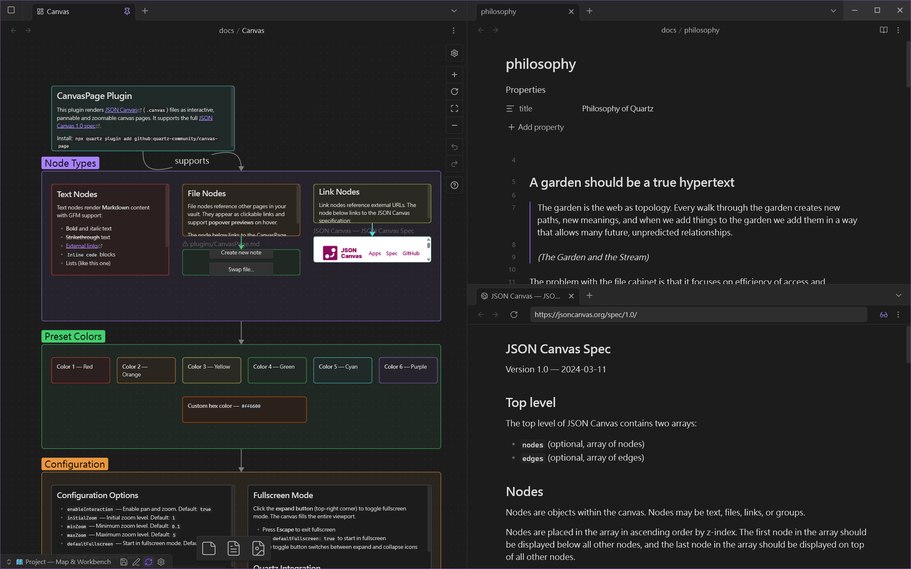
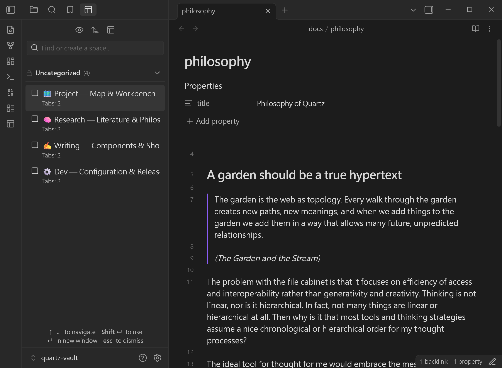

# Window Spaces - Obsidian 視窗工作空間管理外掛

> **解放擁擠的主視窗。將重量級外掛與多元工作流，無痛遷移至獨立、專注的 Popout 彈出視窗工作艙。**

---

## 🌐 Language / 語言

[ English ](README.md) | [ 繁體中文 ](README.zh-TW.md) | [ 简体中文 ](README.zh-CN.md)

---

## 💡 設計哲學：為你的「萬物筆記庫」打造無干擾的專注工作艙

Obsidian 靈活的佈局與強大的外掛生態，讓許多人將其視為終極的**「Everything Notebook（萬物筆記庫）」**。然而，隨著筆記庫日益龐大與各類實用外掛的加入，主視窗往往變得無比擁擠：

- 🗂️ **擁擠不堪的主視窗**：Canvas 畫布、Excalidraw 繪圖、Dataview 查詢儀表板、關係圖譜與多欄分割筆記，都在爭奪同一個主視窗的有限空間。
- ⚡ **繁重的語境切換成本**：在專案規劃、深度文獻研究、日常任務審查之間切換時，必須頻繁打亂原有分頁與側邊欄排版。
- 🖥️ **未被充分發揮的多螢幕優勢**：在多螢幕或大螢幕環境下，缺乏一套能將不同視窗的獨立佈局各自持久保存與快速切換的機制。

**Window Spaces** 作為 Obsidian 的自然、無縫擴展而生。它不是要取代現有佈局，而是透過**焦點攔截技術**與 **Per-Window 獨立視窗佈局生命週期控管**，讓各類重量級外掛與複合筆記分割，無痛遷移至獨立的 **Popout 視窗工作艙（Spaces）**。

主視窗保持簡潔乾淨，不同任務在各自的獨立視窗中自由協作、互不干擾。

---

## 🖼️ 介面預覽

| 🗺️ 獨立 Popout 視窗工作艙 | 🗂️ 側邊欄原生管理面板 | 📑 編輯區標籤頁管理模式 |
| :---: | :---: | :---: |
|  |  |  |
| *Canvas 視覺畫布 + Markdown 雙欄分割與狀態列識別* | *整合式 Spaces 選擇器、啟用狀態提示與快速搜尋* | *在主編輯區分頁中進行完整工作空間管理與檢視* |

---

## ✨ 核心特色

### 🪟 獨立視窗工作艙（Per-Window Layouts）
- **真正的視窗隔離**：完整儲存並恢復彈出視窗（Popout Window）的分割結構、開啟檔案、釘選狀態、視圖模式與螢幕座標，完全不改動主視窗與側邊欄。
- **智慧視窗聚焦**：當嘗試恢復一個已經開啟在彈出視窗的 Space 時，自動平滑聚焦該視窗，避免開啟重複視窗。
- **空白分頁結構防護**：即便特定檔案暫時遺失或更名，仍會保留原有的分欄結構，確保版面不崩塌。

### 🔄 獨立空間自動儲存（Per-Space Auto-Save）
- **無感自動同步**：可為特定 Space 開啟 `🔄 自動儲存` 功能。工作過程中的分欄調整與開啟分頁，會在背景以 5 秒防抖自動更新，並在關閉視窗時立即拍照存檔。

### ⚡ 焦點攔截與全鍵盤極速操作
- **鍵盤優先體驗**：支援 `↑` / `↓` 上下瀏覽、`Enter` 立即於新彈出視窗開啟、`Shift + Enter` 套用至目前視窗、`Esc` 關閉。
- **安全焦點攔截**：僅在面板本身獲得焦點時接管方向鍵與快捷操作，絕不干擾筆記內文編輯、搜尋輸入框或第三方彈出視窗。

### 🎨 三合一原生介面與視覺自訂
- **多元管理入口**：可自由將管理面板停靠在**左側邊欄**、**右側邊欄**、**編輯區標籤頁（Tab）**，或透過 **Ribbon 圖示與快捷鍵** 呼叫快速彈出視窗。
- **視覺自訂識別**：支援自訂 Emoji 圖示、顏色徽章、標籤分類與 6 種維度排序。
- **懸停內容預覽**：滑鼠游標懸停在 Space 上時，即時顯示該空間包含的檔案清單、作用中分頁與釘選結構。

### 🔒 隱私與安全機制
- **100% 本地運作**：所有佈局與設定皆儲存於本地 Vault，無任何遠端通訊。
- **螢幕溢出防護**：拔除外接螢幕時自動校正視窗生成座標，避免彈出視窗出現在螢幕可視範圍外。
- **JSON 批次匯入/匯出**：輕鬆備份配置或在多台電腦設備間同步工作空間範本。

---

## 🚀 典型工作空間場景（Space Workflows）

每個 Space 就像是一個專屬的**作業艙**，針對特定情境量身訂做：

| 工作空間場景 | 佈局配置範例 | 適用情境 |
| :--- | :--- | :--- |
| 🗺️ **Project Map & Workbench** | 左側釘選 Canvas 畫布 / 總覽 + 右側專案規格筆記 | 架構設計、里程碑規劃、交付項目即時追蹤 |
| 🧠 **Deep Research & Literature** | 左側文獻閱讀 / PDF + 右側大綱與雙鏈卡片筆記 | 沉浸式學術研讀、概念串聯與知識萃取 |
| ✍️ **Focus Writing & Showcase** | 純淨 Markdown 編輯區 + 即時樣式預覽 | 長篇創作、技術專欄寫作、發布前校對排版 |
| ⚙️ **Dev & System Maintenance** | Dataview 查詢表格 + 系統設定範本與清單 | 筆記庫定期維護、發行檢查清單、任務分流 |

---

## 📥 安裝方式

### 從 Obsidian 社群外掛市場安裝（推薦）
1. 開啟 Obsidian **設定** > **社群外掛程式**。
2. 關閉「安全模式」，點擊「瀏覽」。
3. 搜尋 **Window Spaces**。
4. 點擊「安裝」，隨後點擊「啟用」。

### 手動安裝
1. 前往 [GitHub Releases](https://github.com/edwardsayer/obsidian-window-spaces/releases) 下載最新版的 `main.js`、`manifest.json` 與 `styles.css`。
2. 在您的 Vault 中建立目錄：`<vault>/.obsidian/plugins/window-spaces/`。
3. 將下載的 3 個檔案放入該目錄中。
4. 重新載入 Obsidian 並在「社群外掛程式」中啟用 **Window Spaces**。

---

## 🛠️ 快速上手

### 1. 建立並儲存你的第一個 Space
1. 建立一個新彈出視窗（按 `Ctrl/Cmd + Shift + N` 或將任何標籤頁拖曳出來）。
2. 排版好你所需的分割視圖（例如：左側 Canvas、右側 Markdown 筆記）。
3. 按 `Ctrl/Cmd + P` 開啟指令面板，執行 **`Window Spaces: Save current Space`**。
4. 輸入名稱（或使用自動生成的智慧命名），並可設定 Emoji 圖示與顏色標籤。

### 2. 恢復與管理 Space
- 透過左側 **Ribbon 圖示**、側邊欄或執行 **`Window Spaces: Open as popup window`** 開啟面板。
- **`點擊` 或 `Enter`**：立即在新彈出視窗中開啟該 Space。
- **`Shift + 點擊` 或 `Shift + Enter`**：將該 Space 套用覆蓋至目前的彈出視窗。
- 點擊右側選單（`...` 或右鍵）可隨時開啟 **自動儲存 🔄**、重新命名、編輯或刪除。

---

## ⌨️ 快捷鍵一覽

| 操作動作 | 快捷鍵 / 觸發方式 | 說明 |
| :--- | :--- | :--- |
| **開啟 Spaces 彈出視窗** | 可於 Obsidian 快捷鍵設定 | 快速呼叫浮動切換與管理對話框 |
| **於新彈出視窗開啟** | `Enter` / 單擊滑鼠左鍵 | 於獨立新視窗中還原選取的 Space |
| **套用至目前視窗** | `Shift + Enter` / `Shift + 單擊` | 將選取的 Space 載入至當前彈出視窗 |
| **快速選取導航** | `↑` / `↓` 方向鍵 | 在 Spaces 清單中上下移動選取項目 |
| **關閉 / 離開** | `Escape` | 關閉對話框或退出搜尋焦點 |

---

## 🤝 大型社群外掛協同工作指南

Window Spaces 與社群中許多強大且佔空間的外掛（如 **Excalidraw**、**Excalibrain**、**Canvas**、**Dataview**、**Notebook Navigator** 等）能達成完美的視窗隔離協同效果。

詳細整合案例與多視窗工作流示範，請參閱：

📖 **[完整使用手冊與外掛協同工作指南](docs/user-guide.zh-TW.md)**

---

## 💻 系統相容性

- **Obsidian 版本需求**：`v1.12.7` 或以上
- **支援平台**：桌面端（Windows, macOS, Linux）
- **授權協議**：MIT License
