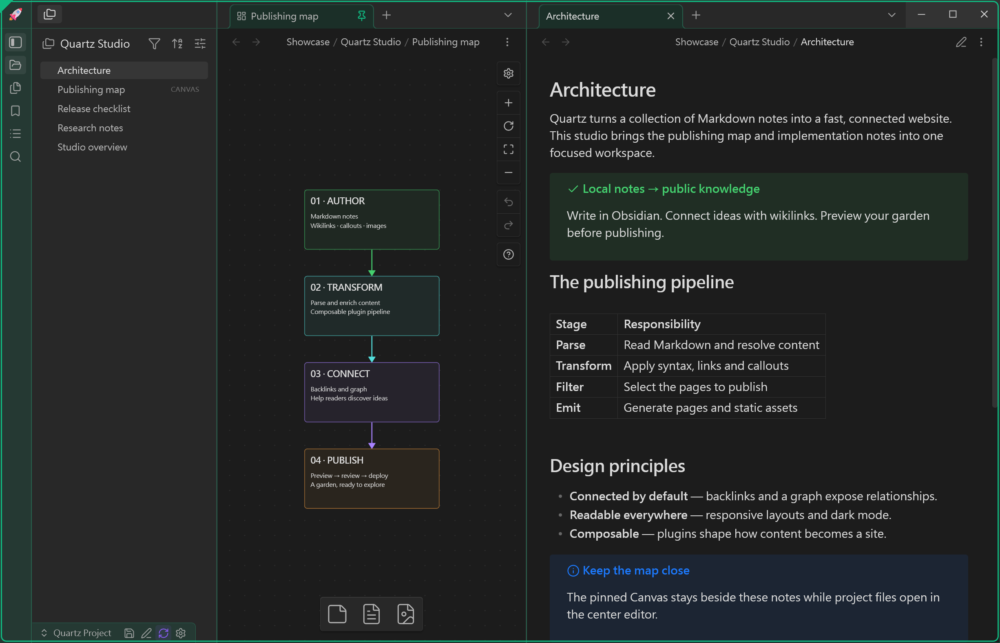
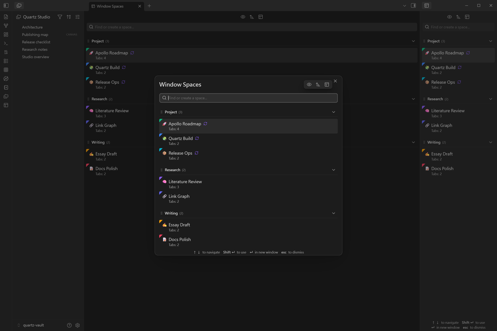
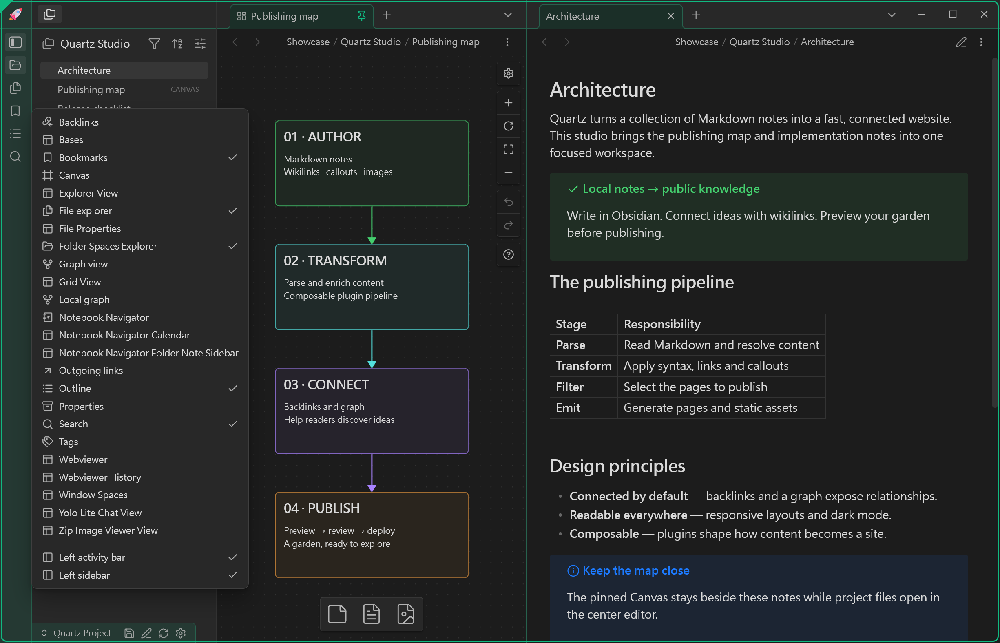
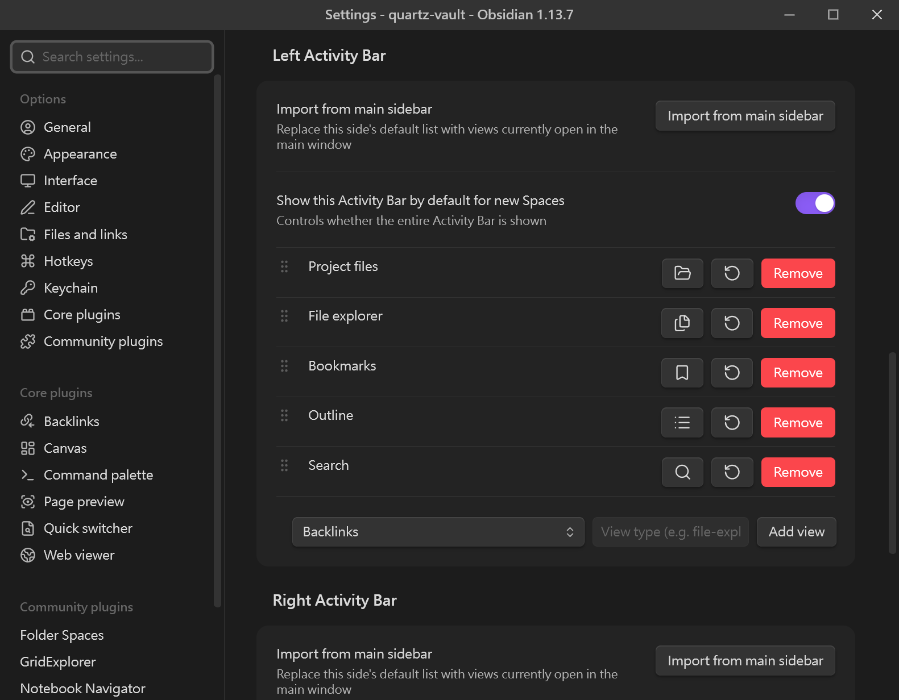
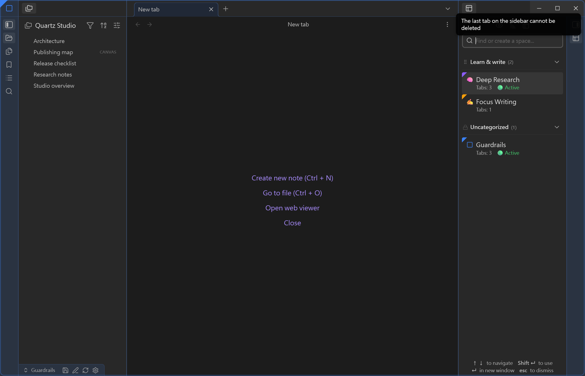
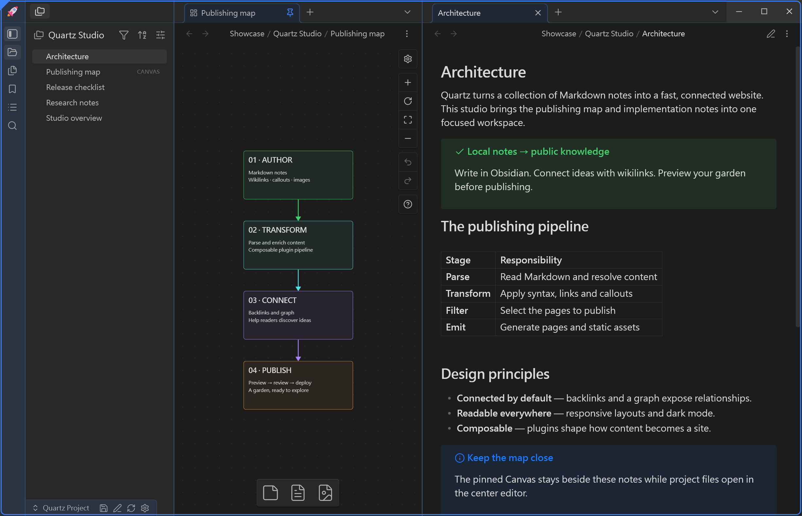
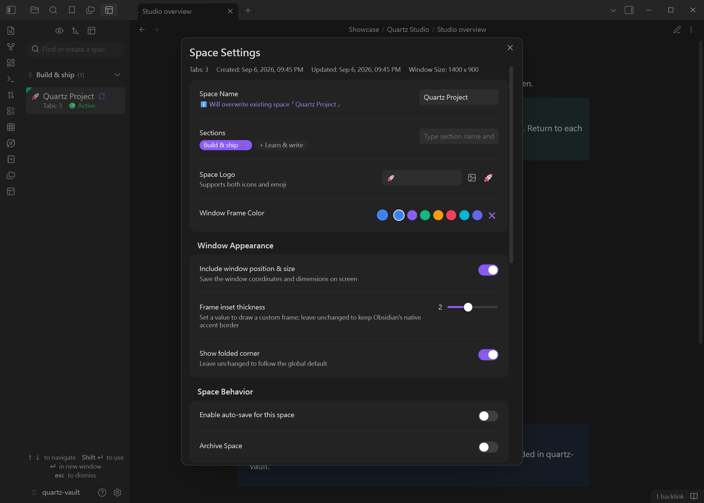

# Window Spaces User Guide & Plugin Synergy Walkthrough

Language: **English** | [繁體中文](user-guide.zh-TW.md) | [简体中文](user-guide.zh-CN.md)

> **Window Spaces** delivers a lightweight, distraction-free, and efficient multi-window layout architecture for Obsidian power users. By isolating heavy plugins and complex pane splits into dedicated popout work cabins (Spaces), you can free up your crowded main workspace.

---

## Table of Contents

1. [Core Architecture & Philosophy](#1-core-architecture--philosophy)
2. [Interface Entry Points & Four Interaction Modes](#2-interface-entry-points--four-interaction-modes)
   - [2.1 Sidebar Panel Mode](#21-sidebar-panel-mode)
   - [2.2 Tab Panel Mode](#22-tab-panel-mode)
   - [2.3 Quick Popup Modal](#23-quick-popup-modal)
   - [2.4 Popout Activity Bar, Context Menu & Smooth Resizing](#24-popout-activity-bar-context-menu--smooth-resizing)
3. [Focus Interception & Keyboard-First Navigation](#3-focus-interception--keyboard-first-navigation)
4. [Per-Window Auto-Save & Dual Layout Collapse Guardrails](#4-per-window-auto-save--dual-layout-collapse-guardrails)
   - [4.1 Per-Space Independent Auto-Save](#41-per-space-independent-auto-save)
   - [4.2 Dual Layout Collapse Guardrails](#42-dual-layout-collapse-guardrails)
   - [4.3 Non-Navigable & Pinned Tab Safe Routing](#43-non-navigable--pinned-tab-safe-routing)
5. [Community Plugin Synergy Walkthroughs](#5-community-plugin-synergy-walkthroughs)
   - [5.1 Folder Spaces Scoped Project Cabin (Double Context Isolation)](#51-folder-spaces-scoped-project-cabin-double-context-isolation)
   - [5.2 Excalidraw Visual Ideation Cabin](#52-excalidraw-visual-ideation-cabin)
   - [5.3 Excalibrain Interactive Knowledge Graph Cabin](#53-excalibrain-interactive-knowledge-graph-cabin)
   - [5.4 Obsidian Canvas Project Roadmap & Whiteboard](#54-obsidian-canvas-project-roadmap--whiteboard)
   - [5.5 Dataview / Projects Data Dashboard](#55-dataview--projects-data-dashboard)
   - [5.6 Notebook Navigator / GridExplorer Structured Navigation](#56-notebook-navigator--gridexplorer-structured-navigation)
6. [Space Customization, Visual Badges & Sorting](#6-space-customization-visual-badges--sorting)
7. [Backup, Export & Multi-Device Sync](#7-backup-export--multi-device-sync)
8. [Frequently Asked Questions (FAQ)](#8-frequently-asked-questions-faq)

---

## 1. Core Architecture & Philosophy

### Why Window Spaces?
Obsidian’s plugin ecosystem is vast and powerful, but as we enable more tools, the main application window quickly becomes overcrowded with sidebars, tab headers, and nested splits:
- **Crowded Main Window**: Canvas, Excalidraw, and Dataview each demand significant screen real estate.
- **Context Switching Friction**: Shifting between deep research, technical writing, and project triage disrupts your carefully arranged tabs and splits.
- **Underutilized Multi-Monitors**: Standard setups lack an effortless way to persistently preserve and restore distinct layouts across separate displays.

Window Spaces acts as an **organic extension of Obsidian**: it manages the layout lifecycle of each independent popout window, leaving the main window pristine while turning each popout into a dedicated task-specific cabin.

*A Quartz Studio popout combines an emerald identity frame, a Canvas workspace, architecture notes, and a live status badge.*

---

## 2. Interface Entry Points & Four Interaction Modes

Window Spaces provides unified and consistent interfaces across your workflow:

### 2.1 Sidebar Panel Mode
- **How to Open**: Run `Window Spaces: Open in left sidebar` or `Open in right sidebar` from the Command Palette.
- **Highlights**: Resides alongside your native File Explorer, ready for instant one-click space switching.

*The unified example keeps Folder Space Explorer on the left while Window Spaces is available in the center and right panels.*

### 2.2 Tab Panel Mode
- **How to Open**: Run `Window Spaces: Open as tab panel`.
- **Highlights**: Expands into a full-page view inside the main editor area, ideal for large screens, bulk management, and renaming.

### 2.3 Quick Popup Modal
- **How to Open**: Click the ribbon layout icon on the left ribbon, or bind a hotkey to `Window Spaces: Open as popup window`.
- **Highlights**: A floating, keyboard-driven switcher designed for fast retrieval and dismissed on demand.

*The foreground switcher in the unified example groups seven spaces into Project, Research, and Writing sections for fast retrieval.*

### 2.4 Popout Activity Bar, Context Menu & Smooth Resizing
Window Spaces equips every independent popout window with a native-grade sidebar and Activity Bar engine:
- **Collapsible Sidebars & Jitter-Free Resizing**: Toggle left/right sidebars using native-styled toolbar buttons. Dragging to resize uses exact `borderBoxSize` calculations with a 1px threshold guard, completely eliminating slow border shrinkage and bounce-backs.
- **Right-Click Context Menu**: Right-click directly on any Activity Bar icon to toggle view visibility, switch sidebars, or toggle sidebar visibility.
- **One-Click Sidebar Sync & Safe Settings Reset**: In plugin settings, easily reorder icons via drag handles, or click "Import from Main Window Sidebar" to replicate your host sidebar layout. Resetting settings restores defaults while safely preserving all saved Spaces.

*Right-clicking a popout Activity Bar icon exposes native-style view and sidebar controls.*

*The settings view provides drag-to-reorder controls and one-click import from the main window.*

---

## 3. Focus Interception & Keyboard-First Navigation

Window Spaces employs **safe focus interception** so you can navigate and trigger spaces without touching the mouse:

| Key | Action | Description |
| :--- | :--- | :--- |
| `↑` / `↓` | Move Selection | Cycle through the list of saved spaces |
| `Enter` | **Open in New Window** | Spawns the highlighted space in a fresh popout window |
| `Shift + Enter` | **Apply to Current Window** | Restores the selected space layout directly into the current window |
| `Esc` | Dismiss / Unfocus | Closes the modal or releases search focus |

> **Safety Guarantee**: Arrow keys and action shortcuts are captured only when the Window Spaces panel is actively focused. They never interfere with editing markdown notes, searching your vault, or using other modals.

---

## 4. Per-Window Auto-Save & Dual Layout Collapse Guardrails

### 4.1 Per-Space Independent Auto-Save
Each Space can independently configure **`🔄 Auto-Save`**:
1. **5-Second Debounced Updates**: When you open new tabs or adjust horizontal/vertical split ratios inside a cabin, Window Spaces records the updated state in the background.
2. **Instant Snapshot on Window Close**: Closing a popout window triggers an immediate final snapshot so no subtle layout adjustment is lost.
3. **Manual Protection**: For fixed templates (e.g. Daily Review template), disable auto-save to ensure accidental edits do not alter the baseline preset.

### 4.2 Dual Layout Collapse Guardrails
In complex multi-pane and sidebar layouts, Obsidian's native tab closure behavior often destroys container leaves, causing entire splits to collapse unexpectedly. Window Spaces introduces dual structural defenses:
- **Central Pane In-Place New Tab Conversion**:
  When you close the last remaining tab in a central split pane (via tab close button or hotkey), Window Spaces intercepts `WorkspaceLeaf.prototype.detach` and replaces the view in-place with an Obsidian native New Tab (`empty` view). This preserves the underlying `WorkspaceTabs` container and split geometry, preventing layout collapse.
- **Sidebar Last Tab Deletion Prevention**:
  Inside a popout sidebar (Left or Right), closing the sole remaining tab is actively blocked by intercepting `detach`. A native Obsidian Notice immediately displays: **"The last tab in the sidebar cannot be closed"**, safeguarding the sidebar container from accidental destruction.

*In one three-column popout, the central last tab becomes a native New Tab while the right sidebar remains intact and displays the protection Notice.*

### 4.3 Non-Navigable & Pinned Tab Safe Routing
When clicking a file from a popout sidebar (such as File Explorer, Bookmarks, or Folder Spaces Explorer), Window Spaces executes intelligent leaf routing:
- **Central Editor Priority**: Clicks from the sidebar are always routed into the central content area, never overwriting sidebar functional views.
- **Navigation Fallback for Non-Navigable / Pinned Views**: If the active center tab contains a **non-navigable view** (e.g., Outline, Canvas, Graph) or is a **pinned tab**, attempting to navigate in-place would either fail or wipe out your active work. Window Spaces detects this state and automatically opens the file in a **new tab** in the central area.

---

## 5. Community Plugin Synergy Walkthroughs

### 5.1 Folder Spaces Scoped Project Cabin (Double Context Isolation)
- **Challenge**: Even when notes are popped out into separate windows, the native File Explorer still presents thousands of vault notes and folders, causing mental friction and distraction.
- **Workflow Setup**:
  - Install and enable the **[Folder Spaces](https://github.com/edwardsayer/obsidian-folder-spaces)** plugin.
  - In your Popout window's Left Activity Bar, add the `Folder Space Explorer` view and lock it to a project directory (e.g., `Projects/Apollo/`).
  - Split the center editor area with a project Canvas roadmap and Markdown task specs.
  - Name the space `🚀 Apollo Project`, pick an Emerald Green accent border, and enable Auto-Save.
- **Synergy Benefits**:
  - **Double Context Isolation**: Window layout is isolated from the main window; the filesystem tree is strictly scoped to the active project.
   - **Smart Leaf Routing**: Clicking files in the Folder Space tree automatically opens them in the central editor, never displacing the scoped sidebar view.

*Folder Space Explorer narrows the visible tree to the Apollo project while Window Spaces preserves the surrounding cabin layout.*

### 5.2 Excalidraw Visual Ideation Cabin
- **Challenge**: Excalidraw benefits from large canvas dimensions; sharing space with markdown notes in the main window compresses text reading.
- **Workflow Setup**:
  - Create a popout space named `🎨 Sketch & Brainstorm`.
  - Dedicate 60% of the left side to the Excalidraw view and 40% on the right to markdown notes.
  - Draw diagrams on the canvas while capturing insights and bi-directional links side-by-side.

### 5.3 Excalibrain Interactive Knowledge Graph Cabin
- **Challenge**: Exploring expansive relationship graphs requires dynamic full-panel rendering, hogging the primary workspace.
- **Workflow Setup**:
  - Launch an `🧠 Excalibrain — Knowledge Graph` popout space on a secondary display.
  - As notes are focused in the main window, the auxiliary cabin displays surrounding context in real time.

### 5.4 Obsidian Canvas Project Roadmap & Whiteboard
- **Challenge**: Canvases contain numerous cards and connection lines; frequent zooming disrupts deep writing flows.
- **Workflow Setup**:
  - Configure a `🗺️ Project — Map & Workbench` space.
  - Pin the Canvas tab on the left and open implementation specs on the right.
  - Because the Canvas tab is pinned, clicking card links always opens the note on the right pane without overriding the whiteboard.

### 5.5 Dataview / Projects Data Dashboard
- **Challenge**: Complex Dataview tables or Kanban projects require wide tables for legible columns.
- **Workflow Setup**:
  - Set up a `📊 Dashboard — Metrics & Triage` window.
  - Top split hosts task queues and progress tables; bottom split hosts quick scratch capture.

### 5.6 Notebook Navigator / GridExplorer Structured Navigation
- **Challenge**: Deep hierarchical trees or grid browsers crowd narrow sidebars.
- **Workflow Setup**:
  - Create a dedicated dual-pane cabin balancing broad navigation on the left with deep reading on the right.

---

## 6. Space Customization, Visual Badges & Sorting

- **Custom Icons & Emojis**: Assign unique Emojis (e.g., 🗺️, 🧠, ✍️, ⚙️) or Lucide icons when saving or editing spaces.
- **Color Presets**: Use visual accent color tags to categorize work domains.
- **Tags & Categories**: Group spaces by project, research, or daily operational routines.
- **6 Sorting Dimensions**: Sort by custom order, title (A-Z / Z-A), tab count, or creation date via the settings menu (⚙️).

*The appearance modal combines the Space name, icon, accent color, and live preview in one place.*

---

## 7. Backup, Export & Multi-Device Sync

- **Local Storage**: All plugin configurations and saved space states reside in `.obsidian/plugins/window-spaces/data.json`.
- **Export Spaces**: Click "Export Spaces" in settings to export layout schemas in standard JSON format.
- **Import Spaces**: Restore or replicate layout cabins on new devices or test vaults with a single click.

---

## 8. Frequently Asked Questions (FAQ)

### Q1: Why does clicking a space refocus an existing window instead of opening a duplicate?
**A**: Window Spaces includes smart duplicate prevention. If the space is already open in an existing popout window, clicking it smoothly focuses that window rather than opening redundant copies.

### Q2: Will popout windows spawn off-screen if I disconnect an external monitor?
**A**: No. Window Spaces includes a boundary correction algorithm that recalculates display geometry and centers windows safely onto the primary screen if the previous display is no longer available.

### Q3: What is the purpose of Empty Tabs?
**A**: If a file referenced by a space is renamed, deleted, or moved, Window Spaces gracefully renders a native empty tab placeholder to preserve your carefully designed multi-pane split layout.

### Q4: Why does closing the last tab in the central pane convert into a New Tab instead of closing the split?
**A**: This is Window Spaces' Central Tab Guard. In Obsidian, closing the last tab in a split destroys the `WorkspaceTabs` container, causing the surrounding layout to collapse. Window Spaces safely substitutes an empty New Tab in-place, keeping your carefully designed multi-pane ratios intact.

### Q5: Why does closing the last tab in a popout sidebar trigger "The last tab in the sidebar cannot be closed"?
**A**: This is the Sidebar Guard. Removing all leaves from an Obsidian sidebar container puts it in an invalid state. Window Spaces intercepts closure to keep the sidebar structure intact. To hide the sidebar, simply click the collapse button on the Activity Bar.

### Q6: Why does clicking a sidebar note open a new tab when Outline or Canvas is active?
**A**: Non-navigable views (like Outline or Canvas) and pinned tabs are protected. Directly replacing their content would break your active workbench. Window Spaces detects these views and cleanly opens the target note in a new tab within the central editor.
